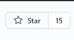

<h1 align=center> Structurex </h1>

## Javascript based Data Structure and Algorithm Visualizer
**Website:**
https://akshitadixit.github.io/Structurex/


<h2 align=center> 📑 Introduction</h2>

**Algorithm Visualizer**  is a  visual illustration of an algorithm’s operation, its perfomance on different kinds of inputs.
Understanding algorithms with visulization is much easy.
**Structurex** project aims to build such **JavaScript** based Data Structure and Algorithm visualizer.

<h2 align="center"> Implementations include:</h2>
<h3>Sorting:</h3>

* Bubble Sort
* Selection Sort
* Merge Sort
* Insertion Sort
* Quick Sort
* Heap Sort

<h3>Searching:</h3>

* Linear search
* Binary Search

<h3> Other </h3>

* Sieve of Eratosthenes

<h3> To-do/In-progress:</h3>

* BST - search, traversals, creation
* A* path finding
* Djikstra's
* A few graph algos (maybe)

<h2 align=center>Tech Stacks:</h2>

- HTML
- CSS
- JAVASCRIPT

<h2 align=center>  How to get started? </h2> 
 
  - [Getting started with git and github](https://guides.github.com/introduction/git-handbook/)
<h3>1.Add a star to this project for more updates on the project.</h3>


<h3>2. Fork the repository </h3>
Fork this repository by clicking on the fork button on the top of this page. This will create a copy of this repository in your account.


**For more details:**

 - [Forking a Repository](https://help.github.com/en/github/getting-started-with-github/fork-a-repo)

<h3>3.Clone the repository </h3>

Now clone the forked repository to your machine. Go to your GitHub account, open the forked repository, click on the **code button** and then click the **copy to clipboard** icon.


Open your terminal/git bash/. 
**Change the current working directory to the location where you want the cloned directory.**
Run the following commands:


```bash
  git init
```
```bash
  git clone  https://github.com/<your-account-username>/Structurex.git
```

` <your-account-username>` should be your github username.

**For more details:**

- [Cloning a Repository](https://help.github.com/en/desktop/contributing-to-projects/creating-a-pull-request)

<h3>4.Create branch </h3>

Now create a branch using the git checkout command:

```bash
    git checkout -b your-new-branch-name
```
Branch name could be anything preferably related to your name or issue.

Keep your cloned repo upto date by pulling from upstream (this will also avoid any merge conflicts while committing new changes)

```bash
    git pull origin main
```

<h3>5.Make changes and commit them</h3>
  Make the necessary changes on your local computer and save the file.

  Add those changes to the branch you just created using the `git add` command:

  ```bash
    git add <file name>
```
or
```bash
    git add --all
```


Commit those changes using `git commit` command:
```bash
    git commit -m "message about what you have done"
```
<h3>6. Push changes to github</h3>

```bash
    git push origin <add-your-branch-name>
```
`<add-your-branch-name>`  name of the branch you created earlier.

<h3>7.Submit your changes</h3>

Once you push the changes to your repo, the `Compare & pull request`button will appear in GitHub.Click it and you will be taken to another screen.Then click `Create pull request` button.

**For more details:**
- [How to create a Pull Request](https://opensource.com/article/19/7/create-pull-request-github)

**CONGRATS!! You have made a sucessful contribtion once your pull request (PR)  gets merged.**
<h2 align=center>👨🏻‍💻 Contribution Guidelines</h2>

- Find an issue that you think you can solve.
If you do not find any issue, try to create one by identifying problems in the project, or wanting to improve something, anything you wish.
- Always ask for the issue to be assigned and only then start working on it.
- Fork the repo. Clone it. Make changes in the code and push to your fork. Then create a pull request. 

- If you have problem with the above workflow, take help from mentors or search about the same on youtube and you will be able to do it.

<h2 align=center> Our valuable Contributors👩‍💻👨‍💻 :</h2>
<a href="https://github.com/akshitadixit/StructureX/graphs/contributors">
  
</a>


<h2 align=center>License 📄</h2>

 See the [LICENSE](./LICENSE) file for details
